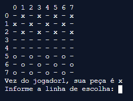
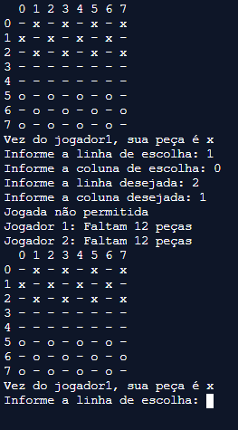
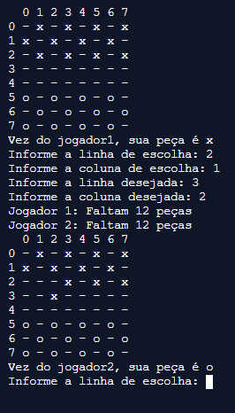

## Checkers - Python3 Console

Project developed for the discipline of Algorithms and Programming, in the first period, of the Computer Engineering course.

### Idea

The idea of the project is to make the game of checkers, so well known, in a digital way with the Python3 language.

### Operation

The player chooses the line and column of the piece to be moved and then chooses the line and column that he wants to place the piece.

### Future works

Make an interface for the game;
Use concepts of object-oriented programming;
Improve error handling.

###### Credits - photos: [Repl.it - Python3](https://repl.it/languages/python3)

> Português

## Jogo de Damas - Console Python3

Projeto desenvolvido para a disciplina de Algoritmos e Programação, no primeiro período, do curso de Engenharia de Computação.

### Ideia

A ideia do projeto é foi fazer o jogo de damas, tão conhecido, de forma digital com a linguagem Python3.

### Funcionamento

O jogador escolhe a linha e a coluna da peça que vai ser movimentada e depois escolhe a linha e a coluna que quer colocar a peça.

### Trabalhos Futuros

Fazer uma interface para o jogo;
Utilizar conceitos de Programação orientada a objetos;
Melhorar o tratamento de erros.

###### Créditos - fotos: [Repl.it - Python3](https://repl.it/languages/python3)
